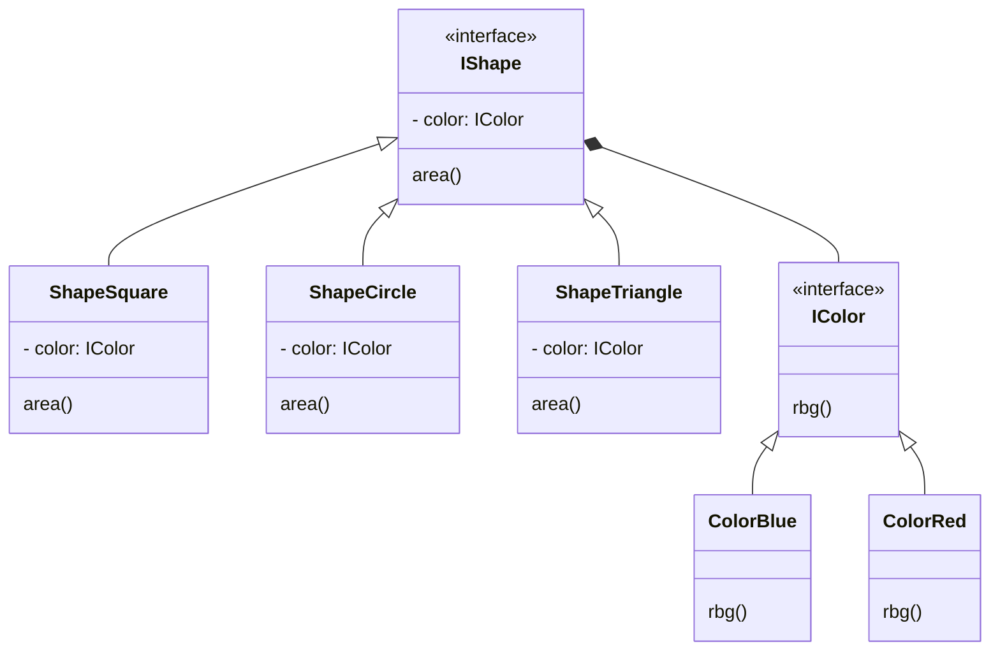

# Pattern Name: Bridge

## How it works

**Bridge** is a structural design pattern that lets you split a large class or a set of closely related classes into two separate hierarchies—abstraction and implementation—which can be developed independently of each other.

Say you have a geometric Shape class with a pair of subclasses: Circle and Square. You want to extend this class hierarchy to incorporate colors, so you plan to create Red and Blue shape subclasses. However, since you already have two subclasses, you’ll need to create four class combinations such as BlueCircle and RedSquare.

Adding new shape types and colors to the hierarchy will grow it exponentially. For example, to add a triangle shape you’d need to introduce two subclasses, one for each color. And after that, adding a new color would require creating three subclasses, one for each shape type. The further we go, the worse it becomes.

This problem occurs because we’re trying to extend the shape classes in two independent dimensions: by form and by color. That’s a very common issue with class inheritance.

## Explanatory diagram

