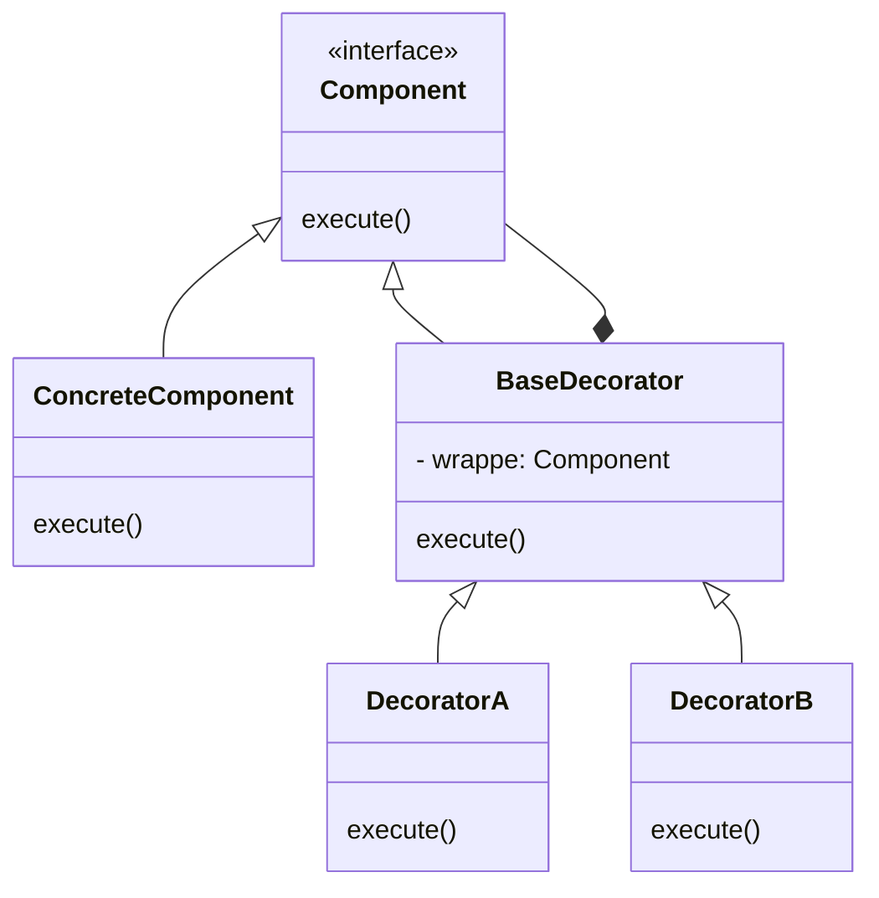

# Pattern Name: [Decorator](https://www.youtube.com/watch?v=GCraGHx6gso)

## How it works

**Decorator** is a structural design pattern that lets you attach new behaviors to objects by placing these objects inside spacial wrapper objects that contain the behaviors

using decorators you can wrap objects countless number of times since **both target objects and decorators follow the same interface**. The resulting object will get a stacking behavior of all wrappers

## Explanatory diagram

