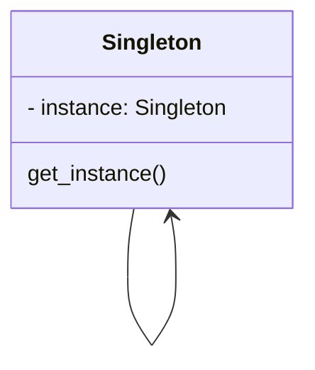

# Pattern Name: Singleton

## How it works

**Singleton** is a creational design pattern that lets you ensure that a class has only one instance, while providing a global access point to this instance.

Why would anyone want to control how many instances a class has? The most common reason for this is to control access to some shared resource—for example, a database or a file.

All implementations of the Singleton have these two steps in common:

Make the default constructor private, to prevent other objects from using the new operator with the Singleton class.
Create a static creation method that acts as a constructor. Under the hood, this method calls the private constructor to create an object and saves it in a static field. All following calls to this method return the cached object.

## Explanatory diagram

