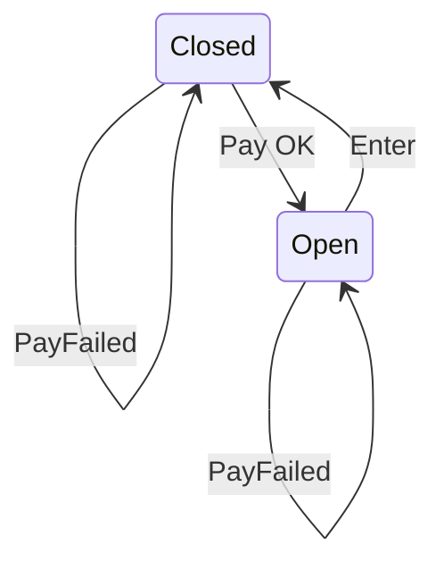

# Pattern Name: State

## How it works

**State** is a behavioral design pattern that lest an object alter its behavior when its internal state changes. It appears as if the object changed it's class

The main idea is that, at any given moment, there's a *finite* number of *states* which a program can be in. Whithin any unique state, the program behaves differently, and the program can be switch from one state to another instantaneously. However, depending on a current state, the program may or may not switch to certain other states. These switching rules, called transitions, are also finite and predetermined.

Imagine a door

- Actions: [Enter, PayOK, PayFailed]
- States: [Open, Closed]
- Interactions: #Actions * #States == 6:
  - Open-Enter -> Closed
  - Open-PayOK -> Open
  - Open-PayFailed -> Open
  - Closed-Enter -> Closed
  - Closed-PayOK -> Open
  - Closed-PayFailed -> Closed

## Explanatory diagram

Add diagram here (Please use mermaid)
