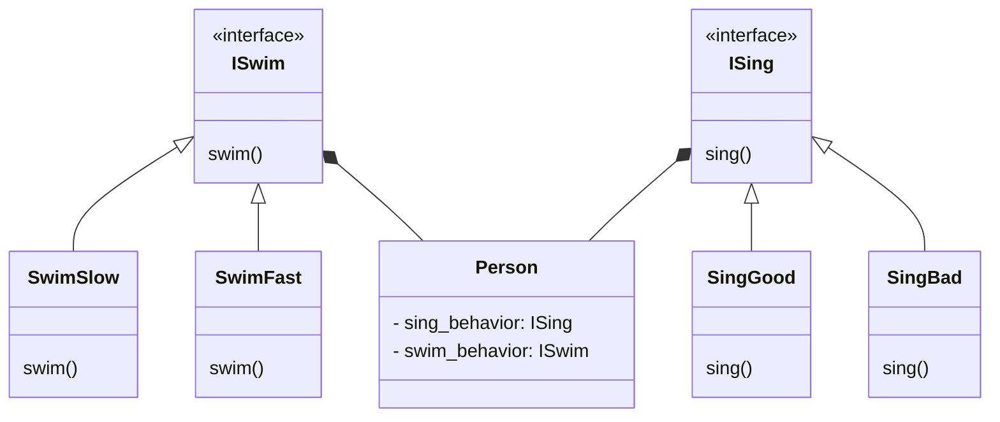

# Pattern Name: [Strategy](https://www.youtube.com/watch?v=v9ejT8FO-7I&list=PLrhzvIcii6GNjpARdnO4ueTUAVR9eMBpc)

## How it works

**Strategy** is a behavioral design pattern that turns a set of behaviors into objects and makes them interchangable inside original context object.

The original object, called **context**, holds a reference to a strategy object. The context **delegates executing the behavior to the linked strategy object**. In order to change the way the context performs its work, other objects may replace the currently linked strategy object with another one.

## Explanatory diagram

