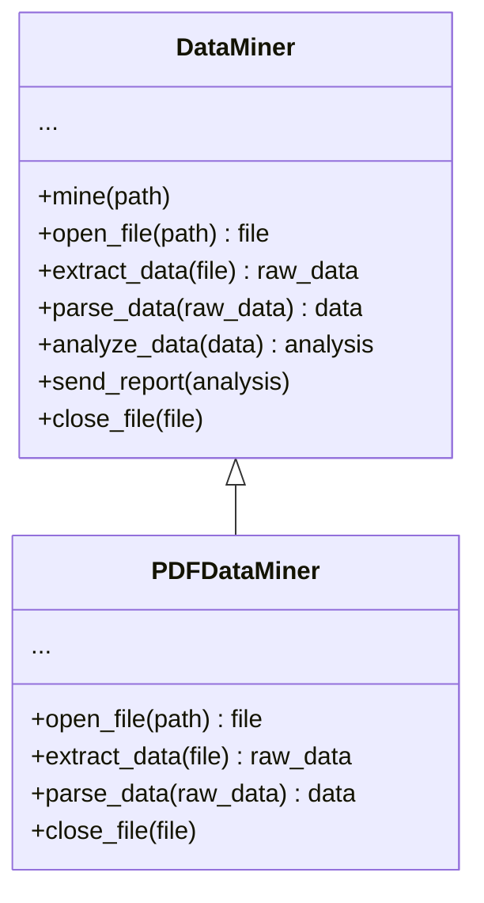
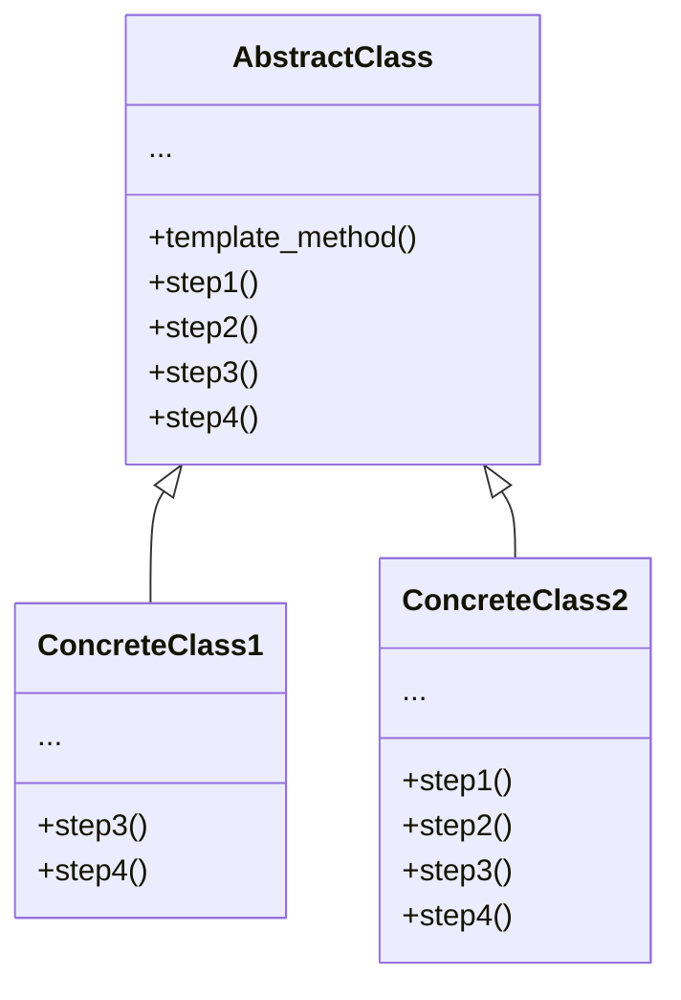

# Pattern Name: Template method

## How it works

**Template Method** is a behavioral design pattern that defines the skeleton of an algorithm in the superclass but lets subclasses override specific steps of the algorithm without changing its structure.

Imagine that you're creating a data mining application that analyzes corporate documents. Users feed the app documents in variours formats (PDF, DOC, CSV), and it tries to extract meaningful data from these docs in a uniform format.

The first version of the app could work only with DOC files. In the following version, it was able to support CSV files. A month later, you "taught" it to extract data from PDF files.

At some point, you noticed that all three classes have a lot of similar code. While the code for dealing with various data formats was entirely different in all classes, the code from data processing and analysis is almost identical. Wouldn't it be great to get rid of the code duplication, leaving the algorithm structure intact?

There was another problem related to client code that used these classes. It had lots of conditionals that picked a proper course of action depending on the class of the processing object. If all three processing classes had a common interface or a base class, you'd be able to elimante the conditionals in the client code and use polymorphism when calling methods on a processing object.

The template method pattern suggests that you break down an algorithm into a series of steps, turn these steps into methods, and put a series of calls to these methods inside a single *template method*. The steps may either be `abstract`, or have soem default implementation. To use the algorithm, the client is supposed to provide its own subclass, implement all abstract steps, and override some of the opetional ones if needed (but not the template method itself).

Let's see how this will play out in our data mining app. We can create a base class for all three parsing algorithms. This class defines a template method consisting of a series of calls to various document-processing steps.

At first, we can declare all steps `abstract`, forcing the subclasses to provide their own implementations for these methods. In our case, subclasses already have all necessary implementations, so the only thing we might need to do is adjust signatures of the methods to mathd the methods of the superclass.

Now, let's see what we can do to get rid of the duplicate code. It looks like the code for opening/closing files and extracting/parsing data is different for various formats, so there's no point in touching those methods. However, implementation of other steps such as analyzing the raw data and composing reports, is very similar, so it can be pulled up into the base class, where subclasses can share the code.

As you can see, we've got two types of steps:

- *abstract steps* must be implemented by every subclass.
- *optional steps* already have some default implementation, but still can be overriden if needed.

There's another type of step, called ***hooks***. A hook is an optional step with an empty body. A template method would work even if a hook isn't overriden. Usually, hooks are placed before and after crucial steps of algorithms, provinding subclasses with additional extension point for an algorithm.

## Explanatory diagram

1. The **Abstract Class** declares methods that act as steps of an algorithm, as well as the actual template method with calls these methods in a specific order. The steps may either be declared `abstract` or have some default implementation.

2. **Concrete Classes** can override all of the steps, but not the template method itself.
